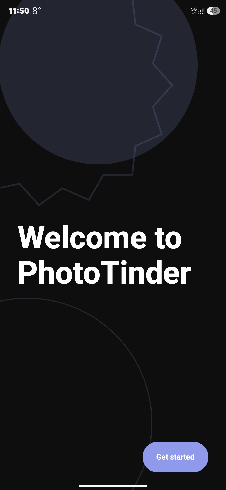
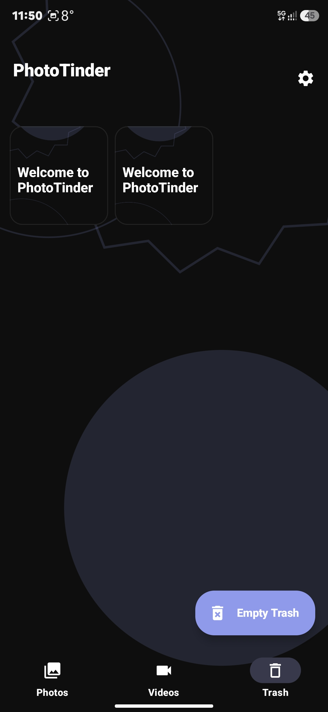
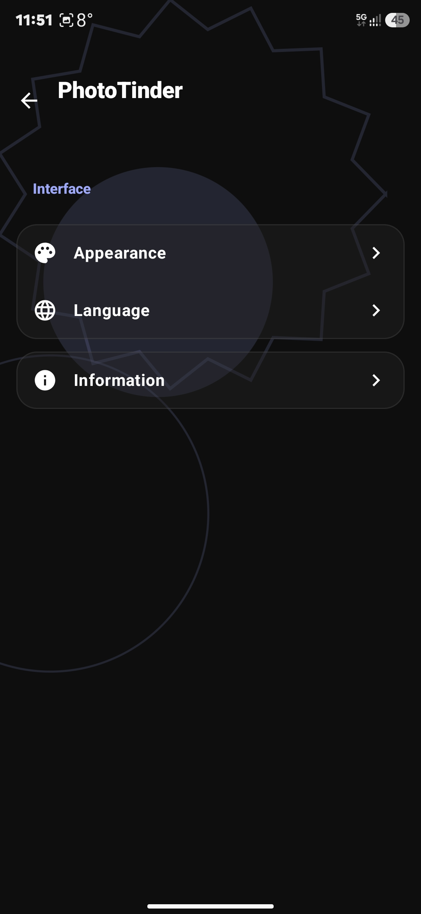
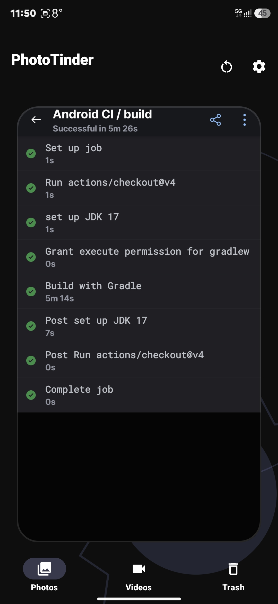

# PhotoTinder 📸🔥

**PhotoTinder** is a gesture-based gallery cleaner designed to help you reclaim your storage space with the same addictive "swipe" mechanic you already know. Instead of dating, you’re making executive decisions on your media: swipe right to keep your memories, and swipe left to send those blurry screenshots and accidental videos to the graveyard.

---

<p align="center">
  
  
  
  
</p>

---

### 🚀 Features

* **Swipe to Decide:** Left to delete, Right to keep. Simple as that.
* **Media Support:** Seamlessly handles both high-res photos and videos.
* **Bulk Cleanup:** Review your "Left Swipes" in a final bin before permanently deleting to avoid "swiper's remorse."
* **Storage Stats:** Real-time tracking of how much space you've recovered.
* **Fast & Lightweight:** Optimized for quick scanning of large galleries.

### 📲 Installation

The easiest way to get started is to download the pre-compiled version directly to your Android device:

1.  Navigate to the [Latest Build](https://github.com/mattia-floria/Photo-tinder/releases/tag/latest-build) page.
2.  Download the **latest signed APK** asset.
3.  Open the file on your device and follow the prompts to install (you may need to "Allow installation from unknown sources" in your settings).

### 📱 Usage

1.  **Open the App:** Grant permission to access your gallery.
2.  **Right Swipe:** Keeps the photo and moves to the next.
3.  **Left Swipe:** Marks the photo for deletion (moves it to the internal Trash).
4.  **Tap:** View the photo or video in full-screen mode.
5.  **Empty Trash:** Navigate to the Trash tab and click **"Empty Trash"** to permanently delete all rejected items from your device.

### 🛠️ Development

This project uses GitHub Actions for continuous integration. Every push is automatically built and verified to ensure stability.

```bash
# To clone and run locally:
git clone [https://github.com/mattia-floria/Photo-tinder.git](https://github.com/mattia-floria/Photo-tinder.git)
cd Photo-tinder
# Follow standard build procedures for your environment
